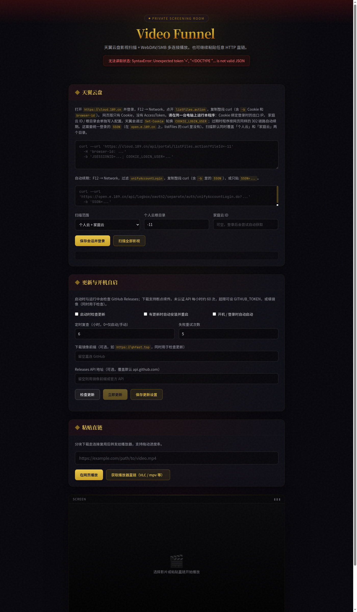
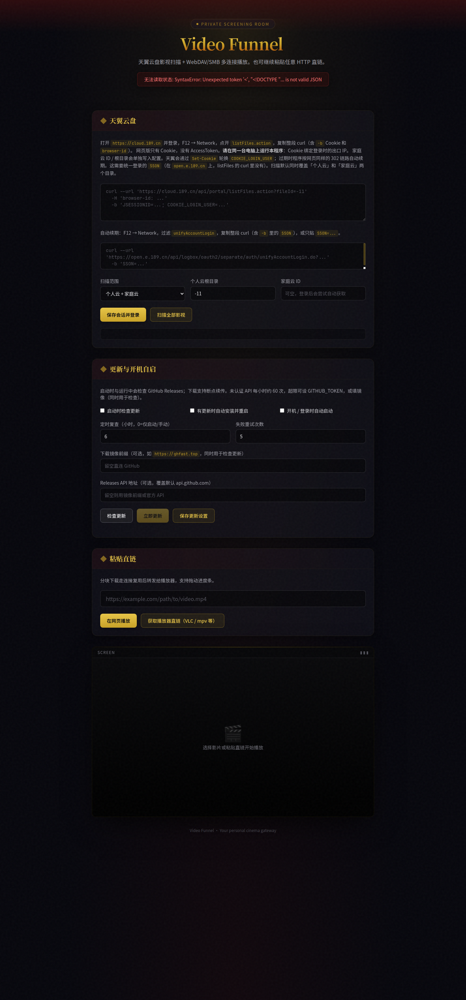

# Video Funnel

本地 HTTP 代理：把限速的远程视频拆成块、通过**连接复用**并行下载，再按 HTTP Range 流给播放器，所以可以拖动进度条。

源码仓库是私有的。这里只发布编译好的 **Native AOT** 二进制：解压即可运行，**不需要安装 .NET**。Web UI 已内嵌在单个 `vf` / `vf.exe` 里。

## 界面预览

影院风格 Web UI：天翼云盘扫描、自动更新 / 开机自启、粘贴直链、底部内置播放器。



内置播放器（页面底部「Screen」区域）：



## 功能概览

| 功能 | 说明 |
| --- | --- |
| 分块 + 连接复用 | 远程文件切成固定大小块，长连接顺序读取，拖动时新开 Range |
| 天翼云盘 (189) | Web UI 粘贴 Cookie 后扫描个人云 / 家庭云影视 |
| WebDAV / SMB | `http://<host>:8080/dav` 或 `smb://<host>:1445/VideoFunnel` |
| 粘贴直链 | 任意 HTTP 视频 URL，网页播放或生成 VLC / mpv 漏斗链接 |
| 自动更新 | 启动时检查 [Releases](https://github.com/huiyuanai709/VideoFunnel-releases/releases/latest)，可自动下载替换并重启 |
| 开机自启 | Windows 启动文件夹 / Linux systemd 用户单元 / macOS LaunchAgent |

## 下载

最新版：**[Releases](https://github.com/huiyuanai709/VideoFunnel-releases/releases/latest)**（当前 **v0.1.8**）

| 平台 | 文件 |
| --- | --- |
| Windows x64 | [vf-win-x64.zip](https://github.com/huiyuanai709/VideoFunnel-releases/releases/latest/download/vf-win-x64.zip) |
| Windows ARM64 | [vf-win-arm64.zip](https://github.com/huiyuanai709/VideoFunnel-releases/releases/latest/download/vf-win-arm64.zip) |
| Linux x64 | [vf-linux-x64.tar.gz](https://github.com/huiyuanai709/VideoFunnel-releases/releases/latest/download/vf-linux-x64.tar.gz) |
| Linux ARM64 | [vf-linux-arm64.tar.gz](https://github.com/huiyuanai709/VideoFunnel-releases/releases/latest/download/vf-linux-arm64.tar.gz) |
| macOS Apple Silicon | [vf-osx-arm64.tar.gz](https://github.com/huiyuanai709/VideoFunnel-releases/releases/latest/download/vf-osx-arm64.tar.gz) |

每个压缩包内只有一个原生可执行文件（`vf` 或 `vf.exe`），Web UI 已内嵌，无需额外文件。

## 快速开始

默认监听 **`0.0.0.0:8080`**（局域网可访问）。只想本机访问时加 `-H 127.0.0.1`。

**Windows**

```bat
vf.exe
```

**Linux / macOS**

```bash
tar -xzf vf-linux-x64.tar.gz   # 或对应平台包
chmod +x vf
./vf
```

浏览器打开 **http://127.0.0.1:8080**：

1. **天翼云盘** — 粘贴 cloud.189.cn 的 curl Cookie，保存并扫描
2. **粘贴直链** — 输入远程视频 URL，网页播放或复制漏斗链接给 VLC / mpv
3. **更新与开机自启** — 勾选自动更新、登录时启动等选项

局域网其它设备访问：`http://<这台机器的 IP>:8080`

## 命令行参数

```
-u, --url          远程视频 URL（单视频模式，直接挂在 "/"）
-H, --host         监听地址（默认 0.0.0.0）
-P, --port         监听端口（默认 8080）
-b, --block-size   块大小，MB（默认 4）
-p, --piece-size   兼容保留（默认 1）
-c, --max-blocks   预取块数（默认 2）
-n, --connections  同时连接数上限（默认 8）
-C, --config       videofunnel.json 路径（默认：系统用户配置目录）
          --install-autostart   启用开机 / 登录自启后退出
          --uninstall-autostart 禁用自启后退出
          --self-update         立即检查并安装最新版
          --no-update-check     跳过启动时的更新检查
          --version             打印版本号
```

## 配置与挂载

配置文件 `videofunnel.json` 默认位置：

- Windows: `%APPDATA%\VideoFunnel\videofunnel.json`
- macOS: `~/Library/Application Support/VideoFunnel/videofunnel.json`
- Linux: `~/.config/VideoFunnel/videofunnel.json`

天翼云盘（189）说明：

- 在 **cloud.189.cn** 登录后，F12 → Network → `listFiles.action`，复制整段 curl（含 Cookie）
- **Cookie 绑定登录时的公网 IP**，请在**同一台电脑**（或同一出口）复制 Cookie 并运行本程序
- 扫描后的文件可通过 **WebDAV**（推荐）或 **SMB** 挂载到播放器：
  - WebDAV: `http://<host>:8080/dav`
  - SMB: `smb://<host>:1445/VideoFunnel`（默认端口 1445，避免与系统 445 冲突）

## 自动更新

发布版会在启动时（及运行中定期）检查本仓库 Releases。Web UI 的 **更新与开机自启** 面板可配置：

- 启动时检查更新 / 有更新时自动安装并重启
- 定时复查间隔（小时）
- 下载镜像前缀（国内可用 `https://ghfast.top` 等 GitHub 加速）

命令行：

```bash
vf --self-update
vf --install-autostart
vf --uninstall-autostart
```

Linux 若需无登录会话也保持运行，安装用户 systemd 单元后执行：`loginctl enable-linger $USER`

## 常见问题

- **189 报 check ip error**：Cookie 与当前出口 IP 不一致，请在本机复制 Cookie 并运行。
- **无法拖动进度条**：远端未支持 `Accept-Ranges` 或无法获取文件长度时，会退化为单连接转发。
- **SMB 挂载失败（Windows）**：445 端口常被系统占用；请改用 WebDAV，或使用默认 **1445** 端口并以管理员运行。

---

Video Funnel · Your personal cinema gateway
