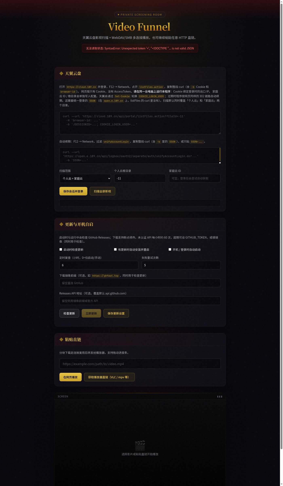
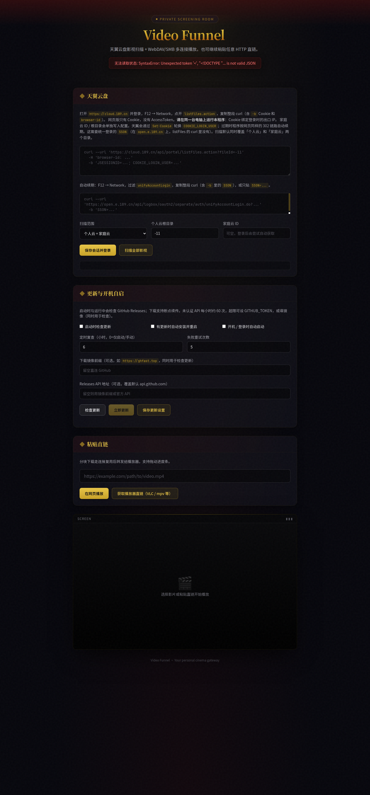

# VideoFunnel

本地视频**加速 / 聚合播放**工具：把天翼云盘、阿里云盘、夸克网盘等里的视频，通过本机代理高速推给播放器（推荐配合 网易爆米花 等支持 WebDAV / 本地播放的客户端）。

一句话：登录网盘 → 打开影院选片 → 用播放器打开，即可拖动进度条流畅观看。

<p align="center">
  
</p>

本仓库只发布编译好的安装包（Native AOT，解压即用，**无需安装 .NET**）。Web UI 已内嵌在单个 `vf` / `vf.exe` 里。

## 下载与安装

在本仓库 **[Releases](https://github.com/huiyuanai709/VideoFunnel-releases/releases/latest)** 下载对应系统的压缩包：

| 系统 | 文件 |
| --- | --- |
| Windows x64 | [vf-win-x64.zip](https://github.com/huiyuanai709/VideoFunnel-releases/releases/latest/download/vf-win-x64.zip) |
| Windows ARM64 | [vf-win-arm64.zip](https://github.com/huiyuanai709/VideoFunnel-releases/releases/latest/download/vf-win-arm64.zip) |
| Linux x64 | [vf-linux-x64.tar.gz](https://github.com/huiyuanai709/VideoFunnel-releases/releases/latest/download/vf-linux-x64.tar.gz) |
| Linux ARM64 | [vf-linux-arm64.tar.gz](https://github.com/huiyuanai709/VideoFunnel-releases/releases/latest/download/vf-linux-arm64.tar.gz) |
| Alpine x64 (musl) | [vf-linux-musl-x64.tar.gz](https://github.com/huiyuanai709/VideoFunnel-releases/releases/latest/download/vf-linux-musl-x64.tar.gz) |
| Alpine ARM64 (musl) | [vf-linux-musl-arm64.tar.gz](https://github.com/huiyuanai709/VideoFunnel-releases/releases/latest/download/vf-linux-musl-arm64.tar.gz) |
| macOS Apple Silicon | [vf-osx-arm64.tar.gz](https://github.com/huiyuanai709/VideoFunnel-releases/releases/latest/download/vf-osx-arm64.tar.gz) |

1. 解压得到 `vf.exe`（Windows）或 `vf`（macOS / Linux）
2. 双击运行，或在终端执行
3. 浏览器打开提示的地址（默认 [http://127.0.0.1:8080](http://127.0.0.1:8080)）

程序可自动检查更新；也可在网页里打开「更新与开机自启」。

## Home Assistant 安装

HA 用户可以直接装加载项（amd64 / aarch64）：设置 → 加载项 → 加载项商店 → 右上角 ⋮ → **仓库**，添加：

```
https://github.com/huiyuanai709/VideoFunnel-releases
```

然后在商店里安装 **VideoFunnel** 并启动，点「打开网页界面」（默认端口 8080）。配置保存在加载项配置目录，版本随本仓库 Releases 自动更新。详见 [加载项说明](videofunnel/DOCS.md)。

## 基本用法

1. **登录网盘**  
   在网页里按提示登录天翼 / 阿里 / 夸克（Cookie、扫码或令牌，以界面说明为准）。
2. **打开影院**  
   在文件列表里点开视频，可先用页面底部自带播放器试看。
3. **用外部播放器打开（推荐）**  
   - **网易爆米花**：添加 WebDAV，地址填本机，路径用 **`/dav/strm`**（适合 STRM）。  
   - 其他支持 WebDAV 的播放器：`http://本机IP:8080/dav`  
   - SMB：`smb://本机IP:1445/VideoFunnel`（默认端口 1445，避免和系统共享冲突）  
   - 也可复制页面上的播放链接，交给 VLC / mpv 等。

配置文件一般在：

- Windows：`%APPDATA%\VideoFunnel\videofunnel.json`
- macOS：`~/Library/Application Support/VideoFunnel/videofunnel.json`
- Linux：`~/.config/VideoFunnel/videofunnel.json`

## 有问题加群

使用中遇到卡顿、登录失败、爆米花挂载等问题，请加 QQ 群沟通：

**群号：754661272**

<p align="center">
  
</p>

扫码或搜索群号 **754661272** 加入。**有问题加群。**

## 界面预览





## 进阶 / 开发者

本仓库面向日常使用。源码仓库 `huiyuanai709/VideoFunnel` 为私有；版本说明见各 [Release](https://github.com/huiyuanai709/VideoFunnel-releases/releases) 页面，调参问题欢迎进群交流。

常用命令行（可选）：

```text
-u, --url          单文件直链模式（省略则进入影院网页）
-H, --host         监听地址（默认 0.0.0.0）
-P, --port         端口（默认 8080）
-C, --config       配置文件路径
    --install-autostart / --uninstall-autostart
    --self-update / --no-update-check / --version
```

## 构建说明

Native AOT 在本仓库的 GitHub Actions 中编译。工作流会用 `SOURCE_TOKEN` 拉取私有源码仓库 `huiyuanai709/VideoFunnel`，产物只发布到本仓库的 Releases。私有仓打 `v*` 标签后，会自动 dispatch 到本仓库的 **Publish Native AOT**。

> 本 README 由私有仓 `releases/README.md` 同步（Sync releases README 工作流），请在那里修改，直接改本仓库会在下次同步时被覆盖。
